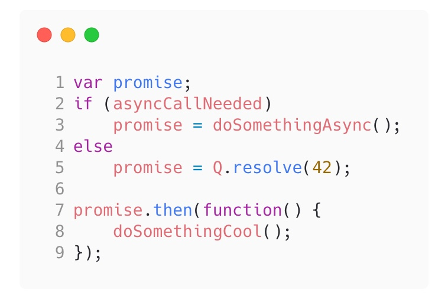
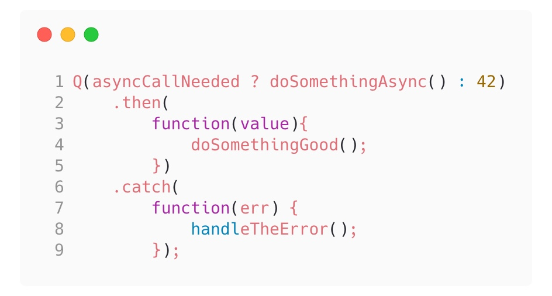

js的异步编程是我们无法避免的话题之一：我们会在平时的编码过程中用到它，也会在面试中遇到它（大雾）

今天就对js的异步发展进行简单的探索，并且顺着流程了解并实现一个符合规范的promise来帮助更好地理解js中异步编程的处理逻辑：

本文第一章节将花费6～8min阅读时间；
第二章如果不着手实现将花费10～15min理解时间；参与实现将花费1h :D
第三章将花费4～6min阅读时间；

行文仓促，如有错误还请指正。

<!-- more -->
# 1. 前言
## 1.1 为何会有异步
  首先我们从为何会有异步入手，主要是有一下子两点原因： 
  1. JS被涉及成单线程的语言，它自身只有一个单一的Call Stack，这就决定了它在某一时刻只能实现一件事情，因此它是同步的；
  2. 目前我们所使用的异步实现都需要平台的支撑（v8或者其他引擎）其次，浏览器是异步的，且为了用户体验不可避免；比如我们打开哔哩哔哩这个网站，就可以发现在同一时间，浏览器的多个模块同时工作，包括：网络请求、渲染界面、DOM事件、定时器等； 
  

图1.1 V8引擎


图1.2 浏览器打开b站所做的工作

## 1.2 异步的实现原理
这里我们可以看一段网络请求代码，如图1.3：接收两个参数，其中success是一个函数，这个函数传递进去不会立即执行，而是等待请求之后再运行这行函数。对于这种传递过去不执行，等待结果之后才执行的函数，我们称他为**回调函数**（callback）。


图1.3 网络请求代码

我们再来看一段nodejs中的代码，区别于前者的是，如图1.4所示的是一段文件I/O的处理。


图1.4 nodejs中文件I/O的处理

由此看来，实现异步的最核心原理在于：**将callback作为参数传递给异步执行函数，当有结果之后再触发callback执行**

我们可以收集一波常用的异步操作，大致分为以下三种：网络请求、IO操作、定时任务；

### 1.2.1 常见的异步操作：
- 网络请求： ajax、http.get
- IO操作：readFile、readdir
- 定时函数： setTimeout、setInterval

那么，在这里提出第一个问题：

### 1.2.2 事件绑定算不算异步操作？


图1.5 事件绑定

在公布答案之前，我们对比一下以下两者之间的区别：

图1.6 事件绑定对比

他们写法相同、执行方式也相同，都会将callback放入call-stack中通过eventloop调用；

那么他们的不同之处在于：调用源不同，前者是用户手动触发、后者是系统读取完文件后调用；此外前者有着比较明显的“订阅-发布”的设计模式痕迹，后者则没有；
<details>
  <summary style="font-size: 16px; font-weight: 700">
    请思考后展开答案
  </summary>
  <span id="17:31:42">[答案1 事件绑定算不算异步操作](#17:31:42-1)</span>
  是也不是，关键要看触发源来自于哪。
</details>

## 1.3 异步的演进方案
关于异步方案的演进，我们可以从图1.7梳理出这样一条链路


图1.7 异步方案的演进

> 

callback到promise阶段发生在jquery时代，在jQuery 1.5版本 以前还有deferred的出现，之后在此基础上出现了promise；

那么在这里再提出一个问题：

### 1.3.1 `$.deferred`和`$.promise`有什么区别？

首先说明，这里的deferred和promise都是jQuery上的对象，不是我们所熟悉的promise。
在回答这个问题之前，先介绍一下deferrd：


deferred有以上5种方法，我们将它区分为两类，前者属于用户掌握控制权，控制deferred对象的状态，后者则将这个权利交给它自身。

<details>
  <summary style="font-size: 16px; font-weight: 700">
    请思考后展开答案
  </summary>
  他们的区别是：promise对象相比于deferred对象，缺少了.resolve和.reject这两个函数属性（没错，与如今的promie有略微区别），你无法在上述划分的第二类方法以外去决议(resolve or reject)一个promise的状态（这个与如今类似）；而deferred可以在外边直接决议；
</details> 
 
Promise在这里更多地被作为一个异步流程控制工具，而非一个订阅发布的事件模块，在此屏蔽了外部状态的改变。（当然，非主流之外的标准大家有兴趣可以自行搜寻或者看参考链接）

按照主流的说法，callback被认为是一个最差的方案，会出现类似于回调地狱这类问题等；而async/await则被认为是所谓异步的终极解决方案。

图1.8 回调地狱

### 1.3.2 callback的引入


图1.9 callback

从流行的趋势来看，这种说法不无道理，我们确实从callback style一步步走到了今天大量使用 async/await 的阶段。那么，是否真是如此？

### 1.3.3 promise也是callback？

稍后我们要介绍的主角Promise，在它的Promise/A+规范中有这么一句表述：


>Promise 表示一个异步操作的最终结果，与之进行交互的方式主要是`then`方法，该方法注册了两个**回调函数**，用于接收 promise 的终值或本 promise 不能执行的原因。

Callback是一个很宽泛的概念，我们可以把promise当作是一个能处理0-1个异步结果的状态管理器：因此，我们可以把callback -> promise的演进看作是一种style到另一种style的过程。

图1.10 promise

### 1.3.4 generator也是callback？
随着进一步演进，在社区中出现了co库将generator与promise结合实现同步写法编写异步代码的解决方案：


图1.11 co-generator

你们猜我是不是想说这也是一种callback style？

没错。。
我们可以把generator函数理解为：
它是一个把执行权一步一步交出去的函数：交出去后怎么回来？这就得调用callback函数。
当然事实没有这么简单，在这个过程中还需要做许多工作，需要恢复上下文执行栈环境等等。

为了印证这个说法，我们来看一个例子：如何将generator视为多个callback的函数的整合。


图1.12 genetator的一个例子

如图1.12所示的代码，我们去掉*和yeild关键字，用朴素函数简化后变成图1.13这个样子。


图1.13 通过朴素函数转化一个generator

就这样，我们构造了一个嵌套了 4 层的 callback，然后在 next 函数的 4 次调用中，分别解开一层层的回调，最后清空了 callback 的层次。实现了与前面的 generator function 相似的行为。

当然，在babel中并不是通过上述方式来实现的，而是利用一个合成函数，通过switch case将它分割成多块，每次只执行其中一个case：

图1.14 babel转化generator的解决方案

### 1.3.5 最后演进到async/await
至于generator到async/await的演进，我们可以视为它是promise + generator这个方案的语义化和标准化。

至此，我们可以将JavaScript里的异步方案演进表述为以下形式<sup>[1][1]</sup>：
Raw Callback Style -> Promise Callback Style -> Generator Callback Style -> Async/Await Callback


图1.15 JavaScript异步方案演进的表述

新的表述跟旧的表述，总体上是一致的。只是描述口径从 4 个不同事物的演进，变成了同种事物的不同形态的演进。

语义化和标准化，不意味着能力的增强，它也有可能导致能力的减弱。
1. 比如generator和async-await对比，generator 既能支持同步行为，也能支持异步行为；而async只支持异步行为。
2. 再比如并行处理，我们需要在async函数中使用promise.all才能达到目的
3. 最后callback虽然被人诟病，但是如果有如图1.16的需求，那又该如何实现？


图1.16 控制并发数的异步请求控制

所以说，如果我们愿意手动管理callback，理论上最原始的callback的表达能力是最强的；
这也很符合这个世界的规律：**等价交换**；


图1.17 有失有得的异步方案演进
从上往下，我们编写代码的方式越来越方便，更易维护；为此付出的代价就是能力削弱，编译器需要识别更多关键字；

初步介绍完js的异步发展过程，我们就开始介绍今日的主角promise：

# 2 Promise
## 2.1 概览

图2.1 不同的Promise

通过之前的描述，我们明白promise的出现那一定是迟早的事，并且promise还有很多兄弟姐妹；
有兴趣的同学可以去看看《聊一聊promise的前世今生》这篇文章<sup>[2][2]</sup>。

如今我们使用的promise更多是在Promies/A+ 基础上增强的Promise ES6标准。

今天的另一个问题就是:

### 2.1.1 图2.1中俩者的promise有啥区别？

<details>
  <summary style="font-size: 16px; font-weight: 700">
    请思考后展开答案
  </summary>
  他们的区别是：ES6中的Promise增加了 `.catch` 方法，增加了 `Promsie.resolve`、`Promise.reject`、 `Promise.all`、`Promise.race`等静态方法
</details> 

作为现代JavaScript中的一部分，理解和掌握Promise对前端开发者异常重要。它几乎成为面试中必问的问题之一，甚至还有一些付费教程教学如何实现一个Promise。

依我之见，互联网上资料丰富，但是也是鱼龙混杂：我们可以通过搜索引擎搜到与关键字相关的NNNN条信息，但是不一定能找到自己想要的信息。可能是我们搜索的关键字、可能是信息太多无法筛选、可能是因为坦克原因不可见、也可能是作者表述与读者理解力的不对等。

我将尽量以一种能看懂的方式实现Promise/A+规范。

不过，正如我所参考的这个实现作者所说的<sup>[1][1]</sup>：
> 不过，如果一个初学者，想通过实现 Promises/A+ 去学习 Promises。或者认为实现了 Promises/A+规范后，对 Promises 的理解水平能得到质的提升。最后可能会失望。

> 实际上，Promises/A+ 规范，内容简短，实现难度低。其中充斥着细节行为的描述，缺乏设计目的和背景的部分，完全没有介绍使用场景。并不是一个入门 Promises 的好材料。

> 即便成功实现 Promises/A+ 规范，也不一定比没实现过的开发者，更善于使用 Promises 特性。

如果想更好地使用Promise，我会推荐你去看promise迷你书<sup>[3][3]</sup>

## 2.2 实现一个 Promise/A+ 规范
我们会使用Promise/A+作者提供的测试套件来测试我们实现的Promise是否符合规范。

现在跟着我一起左手🐲右手🌈

### 2.2.1 前期工作
英文规范： https://promisesaplus.com/
中文规范： https://www.ituring.com.cn/article/66566
测试套件： promises-aplus-tests

git repo: <https://github.com/hemisu/promise-aplus-impl>

左侧打开promise规范网页，右侧编写代码撒。
创建一个目录，再命令行执行：
```bash
git clone https://github.com/hemisu/promise-aplus-impl
cd promise-aplus-impl && npm install
npm run test
```

这样你就可以看到自带的promise的测试结果啦：D

### 2.2.2 开始实现

首先取消掉`src/index.js`中第一行注释，引入我们自己编写的promise

在`src/promies.js`中已经准备好了后面需要使用的一部分类型检测代码。
接着我们就开始对照着Promise/A+规范开始编码（推荐使用英文原版，有标注规范条目，不理解的地方再对照图灵中文翻译）。

### 2.2.3 术语 - 1.terminology

图2.1 Terminology

规范的第一部分描述了几个术语，它们分别如下：

- `promise` 是一个包含 `then` 方法的对象或者函数
- `thenable` 是一个包含 `then` 方法的对象或者函数
- `value` 是一个合法JS值，可以是一个 `undefined` `thenable` `promose`

这里解释一下，value是一个promise内部保持的值，它决议（resolve）成功时我们可以称它为result，而它失败(reject)时我们可以称它为reason。

对应这一节的规范，我们可以编写对应的代码（部分已内置）：
这里的 `thenable` 涉及到鸭子类型(Duck Typing)。鸭子类型可解释为,如果一只动物,走起来像鸭子或者叫起来像鸭子,就可以把它当作鸭子。同理，一个对象或者函数如果有 `then` 方法，我们就可以称它为 `thenable`

```js
// utils
// ...
const isThenable = obj => (isObject(obj) || isFunction(obj)) && 'then' in obj
// ...

// begin here
function Promise() {
  this.result = null;
}

Promise.prototype.then = function() {
  // 
}
```
这一部分没有多少代码需要添加，我们只需要在构造函数中加入一行`value`的内置值就行；另外在原型上挂载一个 `then` 方法

### 2.2.4 promise的状态 - 2.1 Promise States


图2.2 Promise States

这里的规范说明promise有`PENDING`、`FULFILLED`、`REJECT`三种状态；
那么我们先加入这几个常量，在构造函数中声明这个值：
```js
const PENDING = 'pending'
const FULFILLED = 'fulfilled'
const REJECTED = 'rejected'

function Promise(f) {
  this.state = PENDING;
  this.result = null;
}

```

然后从2.1.1 和 2.1.2.* 可以知道第一种可以转变为后面两种，后面两种不可再次 `transition`，我们就再加入一条transition函数让这个函数进行状态变化，并且保存状态变化后的值 `value`。就如之前提到的，如果`state`为`fulfilled`时，`result`就被看作`value`，如果`state`被`rejected`时，`result`就被看作`reason`。

```js
function transition (promise, state, result) {
  if (promise.state !== PENDING) return
  promise.state = state
  promise.result = result
}
```

此外规范中补充，这里的`must not change`不意味着不可变对象，而仅仅是内存指向不变。（即这个value值如果是个对象，修改一下对象里的属性并不会破坏这条规则）

### 2.2.5 then 方法 - 2.2 The then Method


图2.3 then大致描述
then方法的描述就比较地长了，我们逐一来看：
首先规范说要有一个这样的方法，它接收俩参数。既然它这么大方地给了我们就直接复制到之前的代码中吧:D

```js
Promise.prototype.then = function(onFulfilled, onRejected) {
  //
}
```

然后规范的2.2.1 ～ 2.2.3说明了一下这2个参数如果是函数会怎么样、不是函数又会怎么样，我们先略过不看，需要用到的时候我们再提。

2.2.4中提及，这俩参数如果被`called`。哦那他们首先就是函数了。它们必须等到执行上下文只含平台代码的时候才能被执行。这里是什么意思呢？我们看到它有一个备注`3.1`，我们看看图2.4。


图2.4 备注3.1

再补充一份翻译好的规范
> 这里的平台代码指的是引擎、环境以及 promise 的实施代码。实践中要确保 onFulfilled 和 onRejected 方法异步执行，且应该在 then 方法被调用的那一轮事件循环之后的新执行栈中执行。这个事件队列可以采用“宏任务（macro-task）”机制或者“微任务（micro-task）”机制来实现。由于 promise 的实施代码本身就是平台代码（译者注：即都是 JavaScript），故代码自身在处理在处理程序时可能已经包含一个任务调度队列。

大体意思呢就是这个then方法里的俩兄弟需要等下一个事件队列（macro task/micro task）才能执行。那我们先随便上一个：

```js
Promise.prototype.then = function(onFulfilled, onRejected) {
  // 2.2.5 别问，先放着
  setTimeout(() => {}, 0)
}
```

规范2.2.6说then方法可能会被同一个promise多次调用，如果被调用的话需要按照注册的时候的顺序依次调用。

这下我们知道，他们应该放在一个队列中；其次，它们是不是像我们第一节说的回调一样？一个一个被注册到队列中等到需要的时候再拿出来？

于是我们先去构造函数中注册一个队列保存这些注册的`then`回调。
```js
function Promise(f) {
  this.state = PENDING;
  this.result = null;
  // 2.2.6
  this.callbacks = []
}
```

最后来到2.2.7，先看规范：

图2.5 then方法 条目2.2.7

这里说道：`then`方法必须返回一个promise，称它为promies2，之前的promise就称它promise1。其实这里的promise1、promise2不是同一个promise对象了，在之后我们会提到关于这个的反模式写法。我们先加入这一条：

```js
Promise.prototype.then = function(onFulfilled, onRejected) {
  // promise2 2.2.7
  return new Promise((resolve, reject) => {
    //
  })
  // 2.2.5 别问，先放着
  setTimeout(() => {}, 0)
}
```

然后我们发现，2.2.7下面提及的东西都是在执行、返回结果甚至已经要回家过年了#滑稽#（在决议promise1的结果了），我一看这哪行，`PENDING` 状态要做什么都还没干呢。

这时我们前面提及的，我们要把`then`以回调的形式注册到队列中（2.2.6）就需要在这里重拳出击，保存目前所给的所有东西（方便恢复案发现场），排队进入队列。同时，这么多逻辑我们也不能都在一个地方写，为了好看一些，我们抽一个方法`handleCallback`来进行剩余的操作。

为了减少篇幅（文字工作者不利的地方），这里我就把后面要用到的状态(state)和结果(value)都放函数里了。

```js
Promise.prototype.then = function(onFulfilled, onRejected) {
  // promise2 2.2.7
  return new Promise((resolve, reject) => {
    let callback = { onFulfilled, onRejected, resolve, reject }
    if (this.state === PENDING) {
      // 2.2.6
      this.callbacks.push(callback)
    } else {
      // 2.2.4
      setTimeout(() => 
        handleCallback(callback, this.state, this.result), 0)
    }
  })
}

function handleCallback(callback, state, result) {
  // 接下来要大干一场的地方
}
```

然后我们来处理这个`handleCallback`方法：
首先，进了这个方法的promies状态不是笑（fulfilled）就是哭（rejected），我们要对这个进行一个判断。
另外，扔进来的callback包我们也拆一下方便下一步工作。

```js
function handleCallback(callback, state, result) {
  let { onFulfilled, onRejected, resolve, reject } = callback
  if (state === FULFILLED) {
    
  } else {
    // REJECTED
  }
}
```

接着我们就要用到前面提及但是未用的2.2.1～2.2.3条款并结合2.2.7

图2.6 then方法 2.2.1～2.2.3条款

2.2.7.1 如果我们执行 `onFulfilled` 和 `onRejected` 返回的值（这里称为x），它就使用promise的决议过程处理`[[Resolve]](promise2, x)`这个值。那么首先这俩兄弟它得是个function才能返回结果x。我们这里就进行一个判断，然后决议它。

```js
function handleCallback(callback, state, result) {
  let { onFulfilled, onRejected, resolve, reject } = callback
  if (state === FULFILLED) {
    // 进行判断
    if (isFunction(onFulfilled)) {
      const x = onFulfilled(result)
      // 决议它
      resolve(x)
    } else {
    
    }
  } else {
    // 进行判断
    if (isFunction(onRejected)) {
      const x = onRejected(result)
      // 决议它
      resolve(x)
    } else {
    
    }
  }
}
```

然后看到2.2.7.2 如果执行报错，我们要保护它，扔出一个错误作为promise2决议失败的理由。并且，2.2.7.3-4提出，如果俩兄弟不是函数的时候，跟着promise1的情况决议值

经过文字工作者的简单处理，代码就变成了这亚子：
```js
function handleCallback(callback, state, result) {
  let { onFulfilled, onRejected, resolve, reject } = callback
  try {
    if (state === FULFILLED) {
      isFunction(onFulfilled)
      ? resolve(onFulfilled(result))
      // 2.2.7.3
      : resolve(result)
    } else {
      isFunction(onRejected)
      ? resolve(onRejected(result))
      // 2.2.7.4
      : reject(result)
    }
  } catch (e) {
    // 2.2.7.2
    reject(e)
  }
}
```

至此我们的代码应该是这样的:
```js
const isFunction = obj => typeof obj === 'function'
const toString = Object.prototype.toString
const isObject = obj => toString.call(obj) === '[object Object]'
const isThenable = obj => (isObject(obj) || isFunction(obj)) && 'then' in obj
const isPromise = promise => promise instanceof Promise

const PENDING = 'pending'
const FULFILLED = 'fulfilled'
const REJECTED = 'rejected'

function Promise(f) {
  this.state = PENDING;
  this.result = null;
  this.callbacks = []
}

function transition (promise, state, result) {
  if (promise.state !== PENDING) return
  promise.state = state
  promise.result = result
}

Promise.prototype.then = function(onFulfilled, onRejected) {

  // promise2
  return new Promise((resolve, reject) => {
    let callback = { onFulfilled, onRejected, resolve, reject }
    if (this.state === PENDING) {
      this.callbacks.push(callback)
    } else {
      setTimeout(() => 
        handleCallback(callback, this.state, this.result), 0)
    }
  })
} 

function handleCallback(callback, state, result) {
  let { onFulfilled, onRejected, resolve, reject } = callback
  try {
    if (state === FULFILLED) {
      isFunction(onFulfilled) ? resolve(onFulfilled(result)) : resolve(result)
    } else {
      isFunction(onRejected) ? resolve(onRejected(result)) : reject(result)
    }
  } catch (e) {
    reject(e)
  }
}
```
至此我们已经完成了66.66%的工作，因为总共就3条目：D

### 2.2.6 then 方法 - 2.3 The Promise Resolution Procedure

对于大段的英文，我还是先放中文翻译吧：D
>Promise 解决过程是一个抽象的操作，其需输入一个 promise 和一个值，我们表示为 [[Resolve]](promise, x)，如果 x 有 then 方法且看上去像一个 Promise ，解决程序即尝试使 promise 接受 x 的状态；否则其用 x 的值来执行 promise 。

>这种 thenable 的特性使得 Promise 的实现更具有通用性：只要其暴露出一个遵循 Promise/A+ 协议的 then 方法即可；这同时也使遵循 Promise/A+ 规范的实现可以与那些不太规范但可用的实现能良好共存。

直接看中文的好处是我们更熟悉它（大雾
需要抠细节的时候再读原文不失为一种折衷的做法。
对于这第三部分规范，它大题的意思就是我们promise可以resolve不同类型的值，对于不同的值我们要做不同的处理。

首先它说明了这个方法带着promise和一个参数x。并且2.3.1做了一个基本的判断。话不多说我们开干：

图2.7 决议过程1
```js
function resolvePromise(promise, x) {
  if(promise === x) return reject(new TypeError('2.3.1'))
}
```

2.3.2：如果x是个promise，那就沿用x的状态，让promise跟着x的状态走。
这里就类似继承一般，我们只需要在x上注册一个then，把promise的决议方法放进去即可完成要求。

图2.8 决议过程2

```js
function resolvePromise(promise, x) {
  if(promise === x) return reject(new TypeError('2.3.1'))
  if(isPromise(x)) return x.then(resolve, reject)
}
```

来到2.3.3，发现这一条特别长。一条一条解读：
如果我们发现x是一个`thenable`对象或者函数
1: 设一个变量 `then` 指向 x.then
2: 如果取 `x` 的 `then` 属性失败了，捕捉错误 `e` 并决议作为 `reason` 决议 promise 失败
3: 如果 `then` 是一个 `function` 就使它的this指向为x，接收俩个参数分别称为 `resolvePromise` 和 `rejectPromise`

考虑一下，什么方法可以控制一个函数被调用时的 `this` 指向并且返回的还是函数。

2.3.3.3.1 和 2.3.3.3.2 这两条与 2.3.2.2 和 2.3.2.3 有些类似，我们只需要注册一个 `then` 方法，将promise的控制权注册进去即可。

剩余的2.3.3.3 ～ 2.3.3.4 先保留，我们之后来讲。


图2.9 决议过程3

分别判断 `x` 是否为 `promise` 自身、 新的promise、 `thenable`对象之后，剩余的处理方法即2.3.4，以x的决议promise成功

代码如下：
```js
function resolvePromise(promise, x, resolve, reject) {
  if(promise === x) return reject(new TypeError('2.3.1'))
  if(isPromise(x)) return x.then(resolve, reject)
  if(isThenable(x)) {
    try {
      const { then } = x
      if(isFunction(then)) {
        return new Promise(then.bind(x)).then(resolve, reject)
      }
    } catch (e) {
      reject(e)
    }
  }
  resolve(x)
}
```

到这里我们完成了规范主要的部分，剩下的工作就是要拼接+完成之前跳过的细节条目。

首先，为了应对测试套件，我们需要写俩个静态方法：
```js
Promise.resolve = value => new Promise((resolve) => resolve(value))
Promise.reject = reason => new Promise((_, reject) => reject(reason))
```

我们发现这时候 `transition` 方法和 `resolvePromise` 方法还没被使用到。再思考一下平时我们使用promise的方式：
```js
new Promise((resolve, reject) => {})
```
于是我们需要在promise的构造函数中做以下工作：

1. 使用 `transition` 对单个promise进行状态转移
2. 使用 `handleCallback` 对当前的promise转移到下一个promise状态
3. 使用 `resolvePromise` 来处理promise决议成功后的result值
4. 当 `resolve` 或者 `reject` 被多次调用时，只取第一次调用的结果，忽略后面的调用。（2.3.3.3.3）
5. 将 `resolve` 和 `reject` 作为参数，传入 `f` 函数，后续在`new Promise`时就把 `f` 供出去让使用者可以使用 `resovle` 和 `reject` 方法。
6. 构建 `onFulfilled` 和 `onRejected` 提供将当前promise状态转换的能力

这里直接贴上promies构造函数的代码，并且在代码中注释以上完成的功能点：
```js
function Promise(f) {
  this.state = PENDING;
  this.result = null;
  this.callbacks = []
  // 6
  let onFulfilled = value => transition(this, FULFILLED, value) // 1
  let onRejected = reason => transition(this, REJECTED, reason) // 1

  let flag = false; // 4
  const resolve = value => {
    if(flag) return // 4
    flag = true // 4
    resolvePromise(this, value, onFulfilled, onRejected) // 3
  }
  const reject = reason => {
    if(flag) return // 4
    flag = true // 4
    onRejected(reason)
  }

  try {
    // 5
    f(resolve, reject)
  } catch (e) {
    reject(e)
  }
}
```
这里的 `try...catch` 是因为2.2.7.2中，注册的callback如果在 `transition` 到新的状态的过程中抛错，可以在最外层被捕获到，直接决议promies失败。

然后我们就来测试一下现在的代码
```bash
npm run test
```


图2.10 第一次测试结果

这里我看到第一个错误结果就停止继续跑下去了。我们看一下这里报错对应的说明：
> applied to a promise rejected and then chained off of

这里我们大概能猜出**链式**这一问题，回忆之前的代码，我们似乎没有处理注册在 `callbacks` 队列里的 `then` 回调，是否是这个原因导致呢？

我们再实现一个 `handleCallbacks` 来处理队列里所有的 `then` 回调，这里注意我们还是需要遵守2.2.4使其与当前执行上下文不在一起。

```js
function transition (promise, state, result) {
  if (promise.state !== PENDING) return
  promise.state = state
  promise.result = result

  setTimeout(() => handleCallbacks(promise.callbacks, state, result), 0)
}

function handleCallbacks(callbacks, state, result) {
  while(callbacks.length) handleCallback(callbacks.shift(), state, result) 
}
```

完整代码见：[repo](https://github.com/hemisu/promise-aplus-impl)

我们最后跑一下测试。


图2.11 第二次测试结果

可以看到我们已经实现了一个Promies/A+规范（鼓掌）

这里插一个小tip，我们如果把macroTask替换成microTask会不会更快一些捏？这里使用 `process.nextTick` 来替换 `setTimeout`


图2.12 第三次测试结果

可以看到跑完测试的时间减少了3s，非常大的进步：D

## 2.3 增强为ES6的promise

ES6需要补充的方法如下，可以看下面的一个是规范地址，一个是mdn地址；除去还在草案中的allsettled等方法，前面我们已经实现了打勾的部分，我们还需要实现剩下的catch、all、race。
1. <https://tc39.es/ecma262/#sec-promise-objects>
2. <https://developer.mozilla.org/en-US/docs/Web/JavaScript/Reference/Global_Objects/Promise/finally>


图2.13 需要完成的方法

### 2.3.1 Promise.prototype.catch
这个方法其实就是一个语法糖，实现起来十分方便
```js
Promise.prototype.catch = (f) => {
  this.then((resolve, reject) => {
    reject(reason)
  })
} 
```

### 2.3.2 Promise#all
实现 `promise.all` 方法主要注意以下几点：
1. 它不同于还在草案的`allSettled`，`all` 方法在决议失败时只需要返回第一个失败的错误。
2. 传入 `all` 方法的promises是一个数组，全部决议成功后返回的也是一个结果数组，且顺序与promises一致。

接下来的工作我们就只需要判断每个值是否为promise，然后注册在 `then` 中进行处理。

```js
Promise.all = (promises = []) => {
  let results = [];
  let count = 0;
  const fn = (i, resolve) => value => {
    count++
    results[i] = value
    if(count === promises.length) resolve(results)
  }
  return new Promise((resolve, reject) => {
    promises.forEach((promise, i) => {
      try {
        if(isPromise(promise)) {
          promise.then(fn(i, resolve), reject)
        }
      } catch(e) {
        reject(e)
      }
    })
  })
}
```

### 2.3.2 Promise#race
其实实现了 `all` 方法后，`race` 的方法的实现就水到渠成了。我们把上面的`fn`拿走就可以完成了

```js
Promise.race = (promises = []) => {  
  return new Promise((resolve, reject) => {
    promises.forEach((promise) => {
      try {
        if(isPromise(promise)) {
          promise.then(resolve, reject)
        }
      } catch(e) {
        reject(e)
      }
    })
  })
}
```

最后跑一下测试，
```js
Promise.all([
  delay(1),
  delay(2),
  delay(4),
]).then(results => {
  console.log('results', results);
  console.timeEnd(TIME_LOG_NAME)
})

Promise.race([
  delay(1),
  delay(2),
  delay(4),
]).then(results => {
  console.log('results', results);
  console.timeEnd(TIME_LOG_NAME)
})
```

最后一个 `finally` 方法交给大家来解决吧～欢迎在下面提出

# 3 总结
## 3.1实现promise之后的思考
### 3.1.1 它是一个callback management
正如前面所说的，我们可以把promise看作是一个callback management：
也正如它内置状态所展示的一样，它可以处理0～1个异步结果。
如果有了解RxJS的同学，我们可以RxJS当作是一个可以处理0～Infinite个异步结果的库。
这无疑是一种能力的增强，同时也是对编码人员的挑战。如果实际的场景没有这么大的需求，我们不会轻易上这类工具。


图3.1 Callback Management

### 3.1.2 能手写promies实现，就一定精通promies？
我们刚刚实现的Promise/A+ 规范，重点围绕的是 How to implement 通过实现规范，或者所谓的吃透底层源码，以期打通任督二脉的武学幻想，是不切实际的。 想要精通 promises，还得在日常开发的各个异步场景中，多加思考和训练。 我们应当把精通 promises 定义为：
**善于在各种异步场景中使用 promises 解决问题。**
这里就很推荐promise迷你书 <sup>[3][3]</sup>

### 3.1.3 Promise 是比 callback 更先进的异步方案？
正如前面所说的等价交换，语义化和标准化，不意味着能力的增强，它也有可能导致能力的减弱；所以谈不上先进，因为减少心智负担也是重要的一个环节。

- 减少编码的心智负担，提高代码可维护性
- 只有两种callback路径，削弱了灵活性

但是我们也要发现的是：promise 的 `then` 只支持 `onFulfilled` 和 `onRejected` 两种 callback 路径，属于对所有可能的 callback 路径的简化。 
同样是给有兴趣的同学，[callbag][4]库可以使用多个callback函数组合，实现rxjs的observables和iterables。

## 3.2 反模式
最后的最后，我们来看几个反模式。
### 3.2.1 Anti-patterns 1

图3.1 Anti-patterns 1

这块的问题在于没有使用promise方法链。
1. `promise.then`中产生的异常不会被外部捕获 
2. 每次 `promise.then` 调用都会返回一个新创建的promise对象，不能得到 `then` 的返回值

解决方法如图3.2所示

图3.2 Anti-patterns 1 resolution

### 3.2.2 Anti-patterns 2

图3.3 Anti-patterns 2

这个不是一个很严重的反模式，不过还记不记得我们前面实现的时候有写一个resolvePromise方法可以处理不同情况下的result。利用好这一点：D


图3.4 Anti-patterns 2 resolution

### 3.2.3 Anti-patterns 3

图3.5 Anti-patterns 3

这里的问题就在于，`somethingElseAsync`中抛出的函数不会被`handleMyError`处理。
我们可以再注册一个 `then` 方法；或者直接使用 `catch` 语法糖。


图3.4 Anti-patterns 3 resolution

## 3.3 附录

参考：

- 100行代码实现promise 
  <https://mp.weixin.qq.com/s/qdJ0Xd8zTgtetFdlJL3P1g>

- 深入理解Javascript异步 part1 part2    
  <https://github.com/wangfupeng1988/js-async-tutorial>

- promies迷你书
  <http://liubin.org/promises-book/>

- 聊一聊promise的前世今生
  <https://www.cnblogs.com/tarol/p/9042407.html>

- 更多的反模式
  <http://taoofcode.net/promise-anti-patterns/>

## 答案1 事件绑定算不算异步操作
<span id="17:31:42-1">[⬆️ 返回 ⬆️](#17:31:42)</span>

这个问题是在我研究这个主题的时候看到的一个讨论：
[refer: 事件绑定算不算异步？](https://github.com/wangfupeng1988/js-async-tutorial/blob/master/part1-basic/03-event-bind.md)

个人的见解在于，事件绑定是否属于异步操作需要看触发源是否在同一个 [execution context](https://es5.github.io/#x10.3) 中。

通过判断有没有runtime的介入：如果仅仅是在js engine下，它只负责取消息，不负责生产消息；那么在代码中编写的事件绑定就属于一类同步操作；

如果有runtime的介入，比如浏览器DOM事件发送一条合成事件（SyntheticEvent）统一处理，或者是监听onload消息等，js engine在清理完call-stack后接受接收到这条消息并且执行，这时候就可以认为它是异步操作。


[1]: https://mp.weixin.qq.com/s/qdJ0Xd8zTgtetFdlJL3P1g "100行实现一个Promise/A+"
[2]: https://www.cnblogs.com/tarol/p/9042407.html "聊一聊promise的前世今生"
[3]: http://liubin.org/promises-book/ "promise迷你书"
[4]: https://github.com/callbag/callbag "callbag"