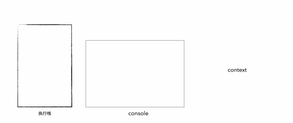

今天我们就来阅读 `NodeJS` 的 `Web` 框架之一 ，`Koa`。

把它放在第一个讲主要是因为它的够短，本体部分只有4个文件不过2k行，非常适合我们学习。

另外解读它的资料非常丰富，小手一点，`CV` 粗加工一下就可以耍一篇文章出来非常的吼啊。

- [介绍 Koa](#介绍-koa)
- [原生实现 - HTTP模块](#原生实现---http模块)
  - [使用 Http module](#使用-http-module)
  - [使用 Koa](#使用-koa)
  - [小结](#小结)
- [Koa 源码解读](#koa-源码解读)
  - [流程](#流程)
    - [第一步 **初始化阶段**](#第一步-初始化阶段)
    - [第二步 **请求阶段**](#第二步-请求阶段)
    - [第三步 **响应阶段**](#第三步-响应阶段)
  - [初始化 Application](#初始化-application)
  - [封装 Context](#封装-context)
    - [代理方法](#代理方法)
    - [`context` 生命周期](#context-生命周期)
  - [中间件 - 重点](#中间件---重点)
    - [函数式 compose](#函数式-compose)
    - [异步串行执行](#异步串行执行)
    - [使用 koa-compose 加入中间件](#使用-koa-compose-加入中间件)
    - [加入中间件](#加入中间件)
  - [错误处理](#错误处理)
- [总结](#总结)
- [参考文献](#参考文献)
  - [补充](#补充)
  - [回复](#回复)

本文相关代码： [git仓库](http://git.xiaojukeji.com/hekunyu/learn-koa)

# 介绍 Koa

> `&tldr` 引入中间件概念，简化原生API并提供简单功能支持

Koa主要提供了什么？这里进行一个复制来的小结：

1. 中间件机制，这种模型极大的提高的扩展性，使的编写扩展非常简单。通过 `context` 在中间件之间传递每次请求时的应用状态，可以让中间件添加或修改属性，例如 `bodyparser` 会修改 `ctx.request.body`
2. 简化 API ，封装每次请求的原生 `request` 和 `response` 对象，`ctx.req` 保存的是原生的 `http` 请求对象，而 `ctx.request` 是 `Koa` 封装了的请求对象。在 `ctx` 绑定一些 `ctx.request` 和 `ctx.response` 的属性别名。`ctx.request` 和 `ctx.response` 上都增加了一些函数例如 `ctx.response.set(headerField, value)` 提高易用性
3. 对 `Web` 的一些常用功能提供简单的支持，例如协商缓存，`request.fresh` 属性就是处理协商缓存的。

为了更深一步了解 `koa` 干了什么，提供了哪些方便，我们先看一下原生实现：

# 原生实现 - HTTP模块

> `&tldr` 对比原生实现，Koa抹平底层让开发人员更灵活地使用

`http` 是 `Node.js` 自带的模块，它提供了一些最基本的功能，可以作为一个客户端（`Client`）发起请求，或者作为一个服务器（`Server`）接受请求并返回响应。

例如写一个 `Server` 代码：

```jsx
const http = require('http');

const server = http.createServer((req, res) => {
  res.writeHead(200);
  res.end('hello world');
});

server.listen(3000, () => {
  console.log('server start at 3000');
});
```

## 使用 Http module

实际生产环境肯定不止这么简单，我们再加上路由（`Router`）和请求方法（`Method`）判断：

```jsx
const http = require('http');

const server = http.createServer((req, res) => {
  // [1]
  const { method, url, headers } = req
  
  // [2]
  if (method === "GET" && url === "/cats") {
    res.statusCode = 200
    res.setHeader("Content-Type", "application/json")
    const resBody = {
      headers,
      method,
      url,
      body: ["Cats", "Tom", "Jerry"]
    }

    res.write(JSON.stringify(resBody))
    return res.end()
  }
  res.writeHead(200);
  res.end('hello world');
});

server.listen(3000, () => {
  console.log('server start at 3000');
});
```

我们打开 [`http://localhost:3000/cats`](http://localhost:3000/cats) 就会看到新增的内容。

假设我们还需要加上 `query` 的解析，支持个 `POST` 方法，再添加一个日志（`logger`）、`Session`、视图模板等等（`中间件`）的支持，代码非常容易随着业务的复杂程度变的臃肿起来；

即使我们把这里的 `(res,res) ⇒ {}` （`callback`）作为小函数抽离，也会因为深层次的回调失去对整个项目的把控。

另外原生的一些API也会在多人协作中产生不同的代码风格，导致问题诞生：

```jsx
response.statusCode = 404;
response.writeHead(404)
```

两者都能改变 `HTTP` 的状态码，你知道这两者背后的区别吗？

## 使用 Koa

那么使用 `Koa` 能带来甚么？我们把上面提到的一些东西用 `Koa` 来实现一遍：

```jsx
const Koa = require('koa');
const router = require('koa-router')();

const app = new Koa();

router.get('/', async (ctx) => {
  ctx.body = "首页";
})
router.get('/cats/:id', async (ctx) => {
  ctx.status = 201;
  ctx.body = { id: '123' }
})

// 中间件1
app.use(async (ctx, next) => {
  const st = Date.now()
  console.log('中间件1 启动'); // [1] logger
	next()
  console.log('中间件1 结束, 耗时: ', Date.now() - st); // [1] logger end
});

// 中间件2
app.use(async (ctx, next) => {
  const st = Date.now()
  console.log('中间件2 启动'); // [1] logger
  next()
  console.log('中间件2 结束, 耗时: ', Date.now() - st); // [1] logger end
});

app.use(router.routes());
app.use(router.allowedMethods());

app.listen(3000);

// 请求后console print:
// 中间件1 启动
// 中间件2 启动
// 中间件2 结束, 耗时:  3
// 中间件1 结束, 耗时:  11
```

`Koa` 使用了`中间件[1]` 的概念来完成对一个 `http` 请求的处理，同时，`Koa`采用了 `async` 和`await` 的语法使得异步流程可以更好的控制。`ctx` 执行上下文代理了原生的 `res` 和 `req`，这让开发者避免接触底层，而是通过代理访问和设置属性。

## 小结

对比完两者之后，提出几点疑惑：

1. `ctx.status = 201` 怎么就可以设置状态吗了？这不是应该在 `res` 对象上吗？
2. 中间件是个啥？里面的 `ctx` 是个啥？第二参数 `next` 又是个啥？
3. 所有中间件执行完成后，为什么可以再返回到原来的中间件进行`耗时统计`？

带着以上三点疑问，我们进行一个源码的读

# Koa 源码解读

这里仅对 `Koa` 的本体进行源码解读，同时表明是 `Koa2` ，规避一些饶人的 `yeild`、`co` 等，更注重过程而不深究语言实现；

## 流程

把大象装进冰箱要分几步？


那Koa的流程分为几步？

### 第一步 **初始化阶段**

```jsx
const Koa = require('koa');
const app = new Koa();

app.use(async ctx => {
  ctx.body = 'Hello World';
});

app.listen(3000);
```

`new` 初始化一个实例，`use` 搜集中间件到 `middleware` 数组，`listen` 合成中间件`fnMiddleware`，返回一个 `callback` 函数给 `http.createServer` ，开启服务器，等待 `http` 请求。

### 第二步 **请求阶段**

每次请求，`createContext` 生成一个新的`ctx`，传给 `fnMiddleware`，触发中间件的整个流程

### 第三步 **响应阶段**

整个中间件完成后，调用 `respond` 方法，对请求做最后的处理，返回响应给客户端。

## 初始化 Application

首先模仿 `Koa` 搭建一个 `Application` 实例：

文件地址 [gitlab](http://git.xiaojukeji.com/hekunyu/learn-koa/blob/7f1f95c8ed3bba36857a823f9e249218165a5f94/01-application/application.js)

```jsx
// ./01-application/application.js
const http = require('http');

class Application {
  constructor() {
    this.callbackFn = null;
  }

  use(fn) {
    this.callbackFn = fn; // 注册中间件
  }

  callback() {
    return (req, res) => this.callbackFn(req, res) // 回调函数
  }

  listen(...args) {
    const server = http.createServer(this.callback());
    return server.listen(...args); // 开启 server
  }
}

module.exports = Application;

// ./01-application/index.js
const Koa = require('./application');
const app = new Koa();

app.use(async (req, res) => {
  res.writeHead(200);
  res.end('hello koa');
});

app.listen(3001, () => {
  console.log('server start at 3001');
});
```

> 本地运行 `git checkout 7f1f95` 并启动 `VSCode debug` 面板里的 `01-application` 即可在 [http://localhost:3001](http://localhost:3001/) 看到效果

这样我们就完成了一个简易的 `Koa` ，通过 `new Koa()` 来新建一个对象，使用 `use` 注册回调函数，并在 `listen` 方法传入回调并调用 `Http module` 的 `listen` 启动 `server`

这里存在俩个问题：

1. `use` 中注册的回调函数入参还是原生回调中的 `req` 和 `res`
2. 多次 `use` 只会保留最后一个回调函数，并不是依次执行多个中间件

接下来就开始分别解决这俩个问题：

## 封装 Context

`HTTP` 作为一个无状态协议，`Koa` 把每次的请求的相关信息(`res`, `req`)都存放在了 `context` 中，方便存取和操作。

接下来就进行简单 `context` 的创建 ：

```jsx
// ./02-context/context.js
const delegate = require('delegates');

const proto = module.exports = {
  // context自身的方法 以下内容方便打印
  toJSON() {
    return {
      request: this.request.toJSON(),
      response: this.response.toJSON(),
      app: this.app.toJSON(),
      originalUrl: this.originalUrl,
      req: '<original node req>',
      res: '<original node res>',
      socket: '<original node socket>'
    };
  },
}

// delegates 原理就是 __defineGetter__ 和 __defineSetter__
// method是委托方法, getter委托getter, access委托getter和setter。
// proto.status => proto.response.status
delegate(proto, 'response')
  .access('status')
  .access('body')

delegate(proto, 'request')
  .access('url')
  .getter('header')
```

### 代理方法

这里就按照顺序讲解，首先是突然出现的 `delegate` 包，这也是 `Koa` 作者 TJ 写的一个代理库，运用了最早的 `__defineGetter__` 和 `__defineSetter__` 方式给 `context` 增加代理访问方式。

例如：

```jsx
delegate(proto, 'request')
  .access('url')
  .getter('header')

// 等同于以下的代码
// access('url') 等于给 proto 加上了 proto.url 指向 proto.request.url 的代理，可以读取和修改
proto.__defineGetter__('url', function(){
  return this['request']['url'];
});
proto.__defineSetter__('url', function(val){
  this['request']['url'] = val;
});

// getter('header') 等于给 proto 加上了 proto.header 指向 proto.request.header 的代理，可以读取原有对象上的值
proto.__defineGetter__('url', function(){
  return this['request']['url'];
});
```

 `mdn` 文档提及这个 `API` 已被废弃：

> This feature is deprecated in favor of defining getters using the object initializer syntax or the `Object.defineProperty()` API. While this feature is widely implemented, it is only described in the `ECMAScript` specification because of legacy usage. This method should not be used since better alternatives exist.

既然是个要被废弃的API，我们就用符合规范标准api实现一下

```jsx
delegate(proto, 'request')
  .access('url')
  .getter('header')

// 可以用以下的新方法实现

Object.defineProperties(proto, {
  url: {
    get() {
      return this['request']['url']
    },
    set(val) {
      this['request']['url'] = val
    }
  },
  header: {
    get() {
      return this['request']['header']
    }
  }
})
```

接着封装一下  `request` 和 `response` 

```jsx
// ./02-context/request.js
module.exports = {
  get header() {
    return this.req.headers;
  },

  set header(val) {
    this.req.headers = val;
  },

  get url() {
    return this.req.url;
  },

  set url(val) {
    this.req.url = val;
  },

  get getJSON() {
    return {
      // 需要打印出去的函数
    }
  }
}

// ./02-context/response.js
module.exports = {
  get status() {
    return this.res.statusCode;
  },

  set status(code) {
    this.res.statusCode = code;
  },

  get body() {
    return this._body;
  },

  set body(val) {
    // 源码里有对val类型的各种判断，这里省略
    /** 可能的类型，演示用
	    1. string
	    2. Buffer
	    3. Stream
	    4. Object
	  */
    this._body = val;
  }

  get getJSON() {
    return {
      // 需要打印出去的函数
    }
  }
}
```

最终在 `Application` 统一引入上述的三个文件

```jsx
const http = require('http')
const Stream = require('stream');
const context = require('./context')
const request = require('./request')
const response = require('./response')

class Application {
  constructor() {
    this.callbackFn = null;
    // 新增
    this.context = Object.create(context)
    this.request = Object.create(request)
    this.response = Object.create(response)
  }

  // 新增
  handleRequest(ctx) {
    const handleResponse = () => respond(ctx)
    // 中间件会以 asyncFunction 的形式返回一个 Promise 所以需要用 .then 注册回调
    return this.callbackFn(ctx).then(handleResponse);
  }

  /**
   * 每次新的请求都会创建新的context
   * @param {http.IncomingMessage} req requestListener的第一个参数
   * @param {http.ServerResponse} res requestListener的第二个参数
   */
  createContext(req, res) {
    const ctx = Object.create(this.context)
    ctx.request = Object.create(this.request)
    ctx.response = Object.create(this.response)
    ctx.req = ctx.request.req = req
    ctx.res = ctx.response.res = res
    ctx.app = ctx.request.app = ctx.response.app = this

    return ctx
  }

  // 修改
  callback() {
    const handleRequest = (req, res) => {
      const ctx = this.createContext(req, res)
      return this.handleRequest(ctx)
    }
    return handleRequest;
  }

  use(fn) {
    this.callbackFn = fn; // 注册中间件
  }

  listen(...args) {
    const server = http.createServer(this.callback());
    return server.listen(...args); // 开启 server
  }
}

module.exports = Application;

/**
 * 根据 ctx.body 返回结果
 * @param {*} ctx 
 */
function respond(ctx) {
  const body = ctx.body
  // ctx.status 判断返回空 body
  // ctx.method 判断 HEAD 返回空 body
  /** 可能的类型，演示用
    1. string
    2. Buffer
    3. Stream
    4. Object
  */
  if (typeof body === 'string') return ctx.res.end(body)
  if (Buffer.isBuffer(body)) return ctx.res.end(body)
  if (body instanceof Stream) return body.pipe(ctx.res)
  if (typeof body === 'object') return ctx.res.end(JSON.stringify(body))
  // empty
  return ctx.res.end()
}
```

> 本地运行 `git checkout 00f39c5` 并启动 `VSCode debug` 面板里的 `02-context` 即可在 [http://localhost:3002](http://localhost:3002) 看到效果

### `context` 生命周期


图中最右边就是上文提及的三个文件，在我们实例化 `Koa` 时会在构造函数中使用 `Object.create(context)` 来创建 `context` 对象，作为其原型链避免污染。

在每次请求进入时会调用 `createContext` 创建 `context` 同时传入原生 `HTTP` 模块的 `req`、`res` 。

`respond` 作为最后一个回调函数，处理最后挂载在 `ctx.body` 中的内容，使用原生的 `res` 对象上的 `res.end` 方法对外返回最终结果。

## 中间件 - 重点

在讲解 `Koa` 中间件之前，先介绍俩个概念，这对我们接下来理解 `koa-compose` 有所帮助

### 函数式 compose

先描述一下函数式编程中的 `compose` 

[在 Runkit 运行](https://runkit.com/hemisu/60601235f67a11001aaa7137)：

```jsx
const greeting = (firstName, lastName) => firstName + ' ' + lastName
const toUpper = str => str.toUpperCase()

// 声明式编程 (函数式)
function compose(funcs) {
  return funcs.reduce((a, b) => (...args) => a(b(...args)))
}

// 命令式编程（面向过程）
function compose1(fns) {
  let length = fns.length;
  let count = length - 1;
  let result = null;

  return function fn1(...args) {
    result = fns[count].apply(null, args);
    if (count <= 0) {
      return result
    }

    count--;
    return fn1(result);
  }
}

const fn = compose([toUpper, greeting]);

const result = fn('jack', 'smith');

console.log(result);
```

这里把 `greetting` 和 `toUpper` 合成一个复合函数 `fn` ，调用这个复合函数 `fn` 会从左到右依次执行 `greetting` 和 `toUpper` ，每次执行完一个就会把返回值作为下一个函数的入参。

`Koa` 中的中间件即为这里的 `gretting` 和 `toUpper`，稍有不同的是 `Koa` 中间件使用的是 `Asnyc Function` ，于是有了下一个概念：**异步串行执行**

### 异步串行执行

这里我们就直接用题来描述这个概念：

实现一个函数 `createFlow` ，使其最终的打印（`log`）效果为：

```jsx
// 先打印a,b,延迟1秒,c,延迟1秒,d,e, done
const delay = (ms) => new Promise((resolve) => setTimeout(resolve, ms));
const log = _ => console.log(_)
const flat = (arr, depth = 1) => 
  arr.reduce((a, v) => a.concat(depth > 1 && Array.isArray(v) ? flat(v, depth - 1) : v), [])

const subFlow = createFlow([() => delay(1000).then(() => log("c"))]);

createFlow([
  () => log("a"),
  () => log("b"),
  subFlow,
  [() => delay(1000).then(() => log("d")), () => log("e")],
]).run(() => {
  console.log("done");
});

function createFlow () {
  // ...实现
}
```

异步串行的**目的**就是给定一个 `promise` 数组 `[promise1, promise2....]`  ，像上面那样顺序执行。当前 `promise2` 的执行时间要在上一个执行 `promise1` 结束后（即需要把当前 `promise` 注册到上一个的回调中）。这种实现与上述的 `fn-compose` 类似，区别在于不再是简单的返回作为下一个入参 `a(b(...args))` ，而是需要 `promise1.then(promise2)` 这样串行起来。

[在 RunKit运行](https://runkit.com/hemisu/606013d4876dcc001a690407)：

```jsx
// 声明式编程 (函数式)
function createFlow(effects = []) {
  return {
    run: (cb) => effects.reduce((promise, cur) => {
        if(Array.isArray(cur)) return promise.then(createFlow(cur).run)
        else if(typeof cur.run === 'function') return promise.then(cur.run)
        else return promise.then(cur)
    },
    Promise.resolve()).then(cb)
  }
}

// 命令式编程（面向过程）
function createFlow(effects = []) {
    const middleware = flat(effects.map(item => item.middleware ? item.middleware : item), Infinity)

    function dispatch (i) {
        let fn = middleware[i]
        if (i === middleware.length) fn = null
        if (!fn) return Promise.resolve()
        try {
          return Promise.resolve(fn()).then(dispatch.bind(null, i + 1));
        } catch (err) {
          return Promise.reject(err)
        }
      }

    return {
        run: (cb) => {
            return dispatch(0).then(cb)
        },
        middleware
    }
}
```

这里的面向过程实现最接近 `koa-compose` 的实现

### 使用 koa-compose 加入中间件

`Koa` 中的中间件本质上就是一个 `async` 函数

```jsx
async (ctx, next) => {
  await next();
}
```

该函数接受两个参数，`ctx` 和 `next`，`ctx` 已经在上文提及过； `next` 函数用于将程序控制权交个下一个中间件。 

通过 `koa.use()`，可以将中间件加入到 `koa` 实例的 `middleware` 数组中。 当 `node` 服务启动的时候，会通过 `koa-compose` 的 `compose` 函数，将 `middleware` 数组包装为一个复合函数 `fn`。

中间件的执行顺序类似洋葱模型，也就是从A中间件执行到B中间件，B中间件执行完成以后，仍然可以再次回到A中间件（`await next()` 之后的部分）。


在上述俩个概念的支持下，看懂下面这个 `koa-compose` 应该是信手拈来了：D

```jsx
function compose (middleware) {
  if (!Array.isArray(middleware)) throw new TypeError('Middleware stack must be an array!')
  for (const fn of middleware) {
    if (typeof fn !== 'function') throw new TypeError('Middleware must be composed of functions!')
  }

  /**
   * @param {Object} context
   * @return {Promise}
   * @api public
   */
  return function (context, next) {
    // last called middleware #
    let index = -1
    return dispatch(0)
    function dispatch (i) {
      // 防止一个中间件里多次调用next
      if (i <= index) return Promise.reject(new Error('next() called multiple times'))
      index = i
      // fn就是当前的中间件
      let fn = middleware[i]
      if (i === middleware.length) fn = next // 最后一个中间件如果也next时进入(一般最后一个中间件是直接操作ctx.body，并不需要next了)
      if (!fn) return Promise.resolve() // 没有中间件，直接返回成功
      try {
        /* 
          * 使用了bind函数返回新的函数，类似下面的代码
          return Promise.resolve(fn(context, function next () {
            return dispatch(i + 1)
          }))
        */
        // dispatch.bind(null, i + 1)就是中间件里的next参数，调用它就可以进入下一个中间件

        // fn如果返回的是Promise对象，Promise.resolve直接把这个对象返回
        // fn如果返回的是普通对象，Promise.resovle把它Promise化
        return Promise.resolve(fn(context, dispatch.bind(null, i + 1)));
      } catch (err) {
        // 中间件是async的函数，报错不会走这里，直接在fnMiddleware的catch中捕获
        // 捕获中间件是普通函数时的报错，Promise化，这样才能走到fnMiddleware的catch方法
        return Promise.reject(err)
      }
    }
  }
}
```

我们可以试验性地写一段中间件帮助理解，在 [RunKit运行](https://runkit.com/hemisu/60602a2ac7c15f001a6b95a8) ：

```jsx
const context = {};

const sleep = (time) => new Promise(resolve => setTimeout(resolve, time));

const test1 = async (context, next) => {
  console.log('1-start');
  context.age = 11;
  await next();
  console.log('1-end');
};

const test2 = async (context, next) => {
  console.log('2-start');
  context.name = 'deepred';
  await sleep(2000);
  console.log('2-end');
};

const fn = compose([test1, test2]);

fn(context).then(() => {
  console.log('end');
  console.log(context);
});
```

执行效果如图所示：



弄懂了这块，我们就理解了 `next` 是做什么的：

`next` 就是一个包裹了 `dispatch` 的函数，如果不包裹会直接执行，导致所有中间件并行执行；又因为 `dispatch` 返回的是 `Promise` ，所以在第 `n` 个中间件 `await next();` 会让我们进入第 `n + 1` 个中间件；而当 `n + 1` 个中间件执行完后可以返回第 `n` 个中间件。

如果在某个中间件不调用 `next` 那么在它之后所有的中间件都不会再调用了。

### 加入中间件

> 本地运行 `git checkout 98494e4` 并启动 `VSCode debug` 面板里的 `03-middleware` 即可在 [http://localhost:3003](http://localhost:3003/) 看到效果

这里我们仅需要修改 `application.js` 中拓展中间件能力即可

```jsx
const http = require('http')
const Stream = require('stream')
const compose = require('koa-compose')
const context = require('./context')
const request = require('./request')
const response = require('./response')

class Application {
  constructor() {
    // 新增 用于存储中间件
    this.middleware = []

    this.context = Object.create(context)
    this.request = Object.create(request)
    this.response = Object.create(response)
  }

  // 修改
  handleRequest(ctx, fnMiddleware) {
    const handleResponse = () => respond(ctx)
    // 中间件会以 asyncFunction 的形式返回一个 Promise 所以需要用 .then 注册回调
    // 使用 fnMiddleware 承载 context
    return fnMiddleware(ctx).then(handleResponse);
  }

  /**
   * 每次新的请求都会创建新的context
   * @param {http.IncomingMessage} req requestListener的第一个参数
   * @param {http.ServerResponse} res requestListener的第二个参数
   */
  createContext(req, res) {
    const ctx = Object.create(this.context)
    ctx.request = Object.create(this.request)
    ctx.response = Object.create(this.response)
    ctx.req = ctx.request.req = req
    ctx.res = ctx.response.res = res
    ctx.app = ctx.request.app = ctx.response.app = this

    return ctx
  }

  callback() {
    const handleRequest = (req, res) => {
      // 新增 中间件变成复合函数
      const fn = compose(this.middleware);

      const ctx = this.createContext(req, res)
      return this.handleRequest(ctx, fn)
    }
    return handleRequest;
  }

  use(fn) {
    // 修改，用于存储中间件
    this.middleware.push(fn)
  }

  listen(...args) {
    const server = http.createServer(this.callback());
    return server.listen(...args); // 开启 server
  }
}

module.exports = Application;

/**
 * 根据 ctx.body 返回结果
 * @param {*} ctx 
 */
function respond(ctx) {
  const body = ctx.body
  // ctx.status 判断返回空 body
  // ctx.method 判断 HEAD 返回空 body
  /** 可能的类型，演示用
    1. string
    2. Buffer
    3. Stream
    4. Object
  */
  if (typeof body === 'string') return ctx.res.end(body)
  if (Buffer.isBuffer(body)) return ctx.res.end(body)
  if (body instanceof Stream) return body.pipe(ctx.res)
  if (typeof body === 'object') return ctx.res.end(JSON.stringify(body))
  // empty
  return ctx.res.end()
}
```

## 错误处理

> 本地运行 `git checkout c3ee4a9` 并启动 `VSCode debug` 面板里的 `04-throw-err` 即可在 [http://localhost:3004](http://localhost:3004) 看到效果

由于 `koa-compose` 得到的复合函数也是一个 `Promise` ，对于错误捕获我们可以在这个复合函数后加入 `.catch` 来捕获异常；

我们可以让 `Application` 继承原生的 `Emitter`，从而实现 `error` 监听

`./04-throw-err/application.js`

```jsx
const Emitter = require('events');

// 继承Emitter
class Application extends Emitter {
  constructor() {
    // 调用super
    super();
    this.middleware = [];
    this.context = Object.create(context);
    this.request = Object.create(request);
    this.response = Object.create(response);
  }

	handleRequest(ctx, fnMiddleware) {
	  const handleResponse = () => respond(ctx)
	  // 中间件会以 asyncFunction 的形式返回一个 Promise 所以需要用 .then 注册回调
	  // 使用 fnMiddleware 承载 context
	  const onerror = err => ctx.onerror(err);
	  // 新增, catch捕获，触发ctx的onerror方法
	  return fnMiddleware(ctx).then(handleResponse).catch(onerror);
	}

	// ...
}

```

`./04-throw-err/context.js`

```jsx
const proto = module.exports = {
  toJSON() {
    // context自身的方法 以下内容方便打印
  },

  // 新增
  onerror(err) {
    const { res } = this;
    if ('ENOENT' == err.code) {
      err.status = 404;
    } else {
      err.status = 500;
    }

    this.status = err.status;
    // 触发error事件
    this.app.emit('error', err, this);
    res.end(err.message || 'Internal error');
  }
}
```

这样我们就可以用两种方式捕获 `Koa` 的异常：

1. 使用中间件捕获
2. 框架 `EventBus` 全局捕获

`./04-throw-err/index.js`

```jsx
const Koa = require('./application');
const app = new Koa();

// 1. 捕获全局异常的中间件
app.use(async (ctx, next) => {
  try {
    await next()
  } catch (error) {
    // 如果看到错误为'error from middleware' 说明捕获到了下个中间件的错误
    // 这里再往外抛一个错误用于验证全局的 error 监听
    throw new Error('error from middleware')
  }
})
app.use(async (ctx) => {
  // 此处扔错，可以被捕获
  a.b.c = 1;
  ctx.body = 'hello tc';
});

app.listen(3004, () => {
  console.log('server start at 3004');
});

// 2. EventBug 监听error事件，捕获全局异常
app.on('error', (err) => {
  console.log(err.stack);
});
```

# 总结


至此，我们过了一遍对 `Koa` 核心实现，在阅读源码的过程中又将它实现了一遍。

实际开发项目还需要使用社区的一些开源的中间件如：

- `koa/router` 处理路由
- `koa-bodyparser` 解析 json 请求体
- `koa/multer` 处理 `multipart` 的表单
- `koa/cors` 处理跨域
- `joi` 处理参数校验
- `jsonwebtoken` 来做 `JWT` 认证

另外还会有涉及缓存的部分，比如 `koa` 是怎么计算协商缓存（`ETag`）的，往深了走可以实现一个中间人 `MITM`，实现一个 `SS`

# 参考文献

- [Koa源码浅析](https://juejin.cn/post/6844903876135485453)
- [Koa源码分析](https://juejin.cn/post/6844903567619260429)
- [浅记koa的洋葱模型实现](https://github.com/niexq/koaComposeTest)
- [Nest.js 和 koa 有什么不一样？](https://www.zhihu.com/question/323525252)
- [可能是目前市面上比较有诚意的Koa2源码解读](https://zhuanlan.zhihu.com/p/34797505)

  [1]: http://way.xiaojukeji.com/community/**nodex**

## 补充
来自大佬的评论：

> 刚入职的小桔子浏览内网，看到了这篇讲的很细的关于koa源码的文章。作为koa贡献者之一，补充一下很重要但是被博主略过的部分。compose代码的初版是tj大神写的的，纵观compose全部代码，next这个地方只在两处提到，一处是函数参数的声明，而另外一处就是`fn=next`。而这里正是tj大神的高明之处，下面截取博主的话来举例：


> if (i === middleware.length) fn = next // 最后一个中间件如果也next时进入(一般最后一个中间件是直接操作ctx.body，并不需要next了)


> 从这句话可以发现一个问题：当循环中的i和数组长度相等的时候（正常来说循环终止是数组length-1），应该是没有下一个中间件了，为什么还要加这个判断？试想如下这个case:


> `compose([a,b,c,compose([d,e]),f])()`（其中abcdef表示中间件函数）。

> 当执行完c函数的时候，会执行到`compose([d,e])`，下面说重点了！！！也就是在走到嵌套compose的时候，外层compose的next 是dispatch(f) 并且会带入到内部的compose中（因为compose本身就是一个中间件形式），然后继续嵌套执行里面的compose。在执行嵌套的compose的时候，走的是嵌套compose内部的递归，并没有改变嵌套外面的next，然后等e走完的时候，神奇的事情发生了，会触发到上面那个方法`fn = next `，也就是dispatch(f) 会被交接继续执行。这样函数的控制权又回到了外层compose。

> tj大神仅用这一行代码，就实现了compose嵌套模型的上下文交接。

## 回复

感谢大牛细致的阅读和评论，看到这段case让我眼前一亮，重新去看了一遍compose的用例跑了一遍，对应上case的这一段：


`https://github.com/koajs/compose/blob/master/test/test.js#L216-L235`


如果有读者阅读到这一段可以打断点跑一下上述的case，如果要再次解释这一行 `if (i === middleware.length) fn = next` ，我应该会从俩方面了来解释：


1. next 可以看作是一个迭代器的一个方法，它在此表现为驱动下一个中间件执行的能力；而当 i === middleware.length ，它就体现出移交控制权的能力（可以类比 generator 中的 yeild），执行它就会回到上层的迭代器。


2. 重点在于，compose 的返回结果依旧是个 middleware： 在上述的 case 中，驱动到嵌套的部分会将 next 传入，在嵌套的 compose 驱动完毕后会运行这个 next，使得运行的上下文由回到了上层的驱动器中进行迭代。


这种控制权的交接，上下文的恢复以及驱动方式，在还没出现 generator 语法之前就通过这种 pollyfill 的方式实现在 js 中，不得不佩服 ：D
