- [背景](#背景)
  - [例子一： 现有 Koa 开发体验](#例子一-现有-koa-开发体验)
  - [例子二： 使用 Baas-Dubbo](#例子二-使用-baas-dubbo)
    - [**服务端代码（java）**](#服务端代码java)
    - [**客户端代码（js实现）**](#客户端代码js实现)
  - [小结](#小结)
- [使用](#使用)
  - [一、获得执行上下文 (ctx) 提示](#一获得执行上下文-ctx-提示)
  - [二、Dubbo ProxyService 自动生成及代码提示](#二dubbo-proxyservice-自动生成及代码提示)
  - [高级用法](#高级用法)
    - [1. 重载（同名方法）](#1-重载同名方法)
    - [2. 多态（拓展入参）](#2-多态拓展入参)
  - [小结](#小结-1)
- [原理及实现](#原理及实现)
- [参考链接](#参考链接)


# 背景

从 《FaaS原理及实现介绍》 我们了解到，`Serverless` 的概念主要通过函数即服务（`FaaS`）和后端即服务（`BaaS`）两种形式来落地，它使我们用户可以更便捷地开发接口，让我们专注于业务逻辑，其部署运维工作可以交由平台侧解决；

我在使用 `Serverless` 作为服务的过程中，发现目前的 `FaaS` 开发过程中存在着以下问题：

1. `FaaS`  内置以 `Koa` 作为框架，在 `context` 中添加 `BaaS` 对象提供后端能力，在使用过程中需要随时查阅，且由于文档的滞后，部分功能还需要去看源码才能知道如何使用
2. `BaaS` 中有一项重要的能力就是 `RPC` 通讯，目前支持的 `dubbo` 协议需要自行编写序列化转化的过程（将 `js` 中的类型转换为 `java` 中的类型）进行传输，其中就需要用户自行查看 `java` 的代码来编写 `Proxy`

## 例子一： 现有 Koa 开发体验

依照 开发文档，我们初始化一个 `FaaS` 项目后，`function` 目录下是 `faas` 函数的代码，文件名即为它的路由地址；

初始的项目里有一个 `hello.js` 文件，代码如下：

```jsx
module.exports = async (params, ctx) => {
  return {
    hello: 'faas!',
  };
};
```

作为一个初次接触的用户，在查阅开发文档后会出现几个问题：

1. 这个 `params` 是啥？这个接口 `method` 是 `GET` 、`POST` 还是其他？请求内容中上传的文件会到哪儿？
2. `ctx` 上包含了什么能力，介绍是对 `koa`  的封装，有哪些功能在上方？
3. 我想用 `BaaS` 的能力，想调用 `mysql`、`redis` 、`dubbo` ，想要请求三方接口，我该从哪里调用？

在现有的开发IDE下，仅从上方简短的代码中是无从解决这些问题的，开发的体验就变成了 `“文档” → "代码" → "文档"` 之间的循环。

## 例子二： 使用 Baas-Dubbo

按照官方 `dubbojs` 的架构，我们要实现褐色框内的部分
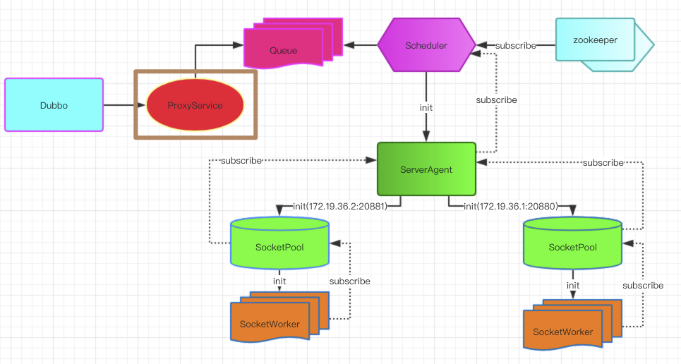

### **服务端代码（java）**

```java
public class UserRequest {
    private Integer id;
    private String name;
    private String email;
    private Sex sex;
}

public enum Sex {
    male, female
}

public interface DemoProvider {
    UserResponse getUserInfo(UserRequest request);
}
```

### **客户端代码（js实现）**

这里仅使用简单实现，声明 `Dubbo.proxyService` 指定调用的 `Dubbo Interface` 和 `method`

```jsx
const DemoProvider = (dubbo) =>
  dubbo.proxyService({
    dubboInterface: 'com.didichuxing.dubbo.service.DemoProvider',
    version: '1.0.0',
    methods: {
      getUserInfo() {
        return java.combine(
				  'com.didichuxing.dubbo.service.UserRequest',
				  {
				    id: java.Integer(1),
				    name: java.String('serverless'),
				    email: java.String('serverless@didiglobal.com'),
				    sex: java.combine('com.didichuxing.dubbo.service.Sex', 'male')
				  }
				)
      }
    }
  })
```

## 小结

从上面的两个例子来看，仅按照原有的思路并不能得到 `FaaS` "**开发方便"** 的想法，那么如何提升现有的开发体验？

针对以上问题，依照社区的 `FaaS` 框架 `midway` 使用了 `TS` + `Decorator` 来实现函数执行上下文（`ctx`）的类型注解，这使得我们需要将现有的 `FaaS` 解决方案升级到 `TS` 。

这是一个现今还在争论的问题，个人认为盲目上 `TS` 还是不可取的，首先 `FaaS` 是一个轻量级的应用没必要上，上了 `TS` 也不能确保会不会变成 `any script`；其次我认为未来还是会以 `js` + `d.ts` 的路子为主，即保留的脚本语言的自由度也有一定的提示效果。

# 使用

## 一、获得执行上下文 (ctx) 提示

> **思路**：注释即文档，提供 `d.ts` 并注入到当前项目

依赖于 `sls-cli` 的[插件方案](https://base3.xiaojukeji.com/docs/Serverless/%E5%BC%80%E5%8F%91%E8%80%85%E5%B7%A5%E5%85%B7/CLI/%E6%8F%92%E4%BB%B6%E5%BC%80%E5%8F%91/%E6%8F%92%E4%BB%B6%E8%A7%84%E8%8C%83.html)，在初始化当前项目后，安装和升级依赖：

```bash
npm i -D @didi/sls-cli-plugin-types@beta @didi/sls-cli-plugin-faas@beta
sls types --r
```

运行 `sls types --r` 后，将你 `function` 下的文件都加上一段 `JSDoc` 的注释，这样前面的 `hello.js` 就会变成如下

```jsx
/**
 * @typedef {import('@didi/sls-cli-plugin-types/types').SlsContext} ctx
 * @param {ctx} ctx
 */
module.exports = async (params, ctx) => {
  return { hello: 'faas!' };
};
```

这样，在编写代码时就能知道执行上下文中存在的内容，使用 `ctx.logger` 将日志写入平台、`ctx.rp` 调用 `http` 请求、`ctx.baas` 调用后端服务等过程中得到对应的提示。

## 二、Dubbo ProxyService 自动生成及代码提示

如果需要启用 BaaS 的能力，我们需要修改 `sls.json` 进行配置

这里调用的是一个我们自己搭建的 [Java 项目](http://git.xiaojukeji.com/nodex/java-sls-dubbojs-api)

```json
{
  "type": "faas",
  "baas": {
    "test": {
      "dubbo3": {
        "dubboSetting": [
          [
            [
              "com.didichuxing.dubbo.service.SimpleService",
              "com.didichuxing.dubbo.service.DemoService",
              "com.didichuxing.dubbo.service.DemoProvider"
            ],
            {
              "applicationName": "sls-demo-service"
            }
          ]
        ],
        "config": {
          "applicationName": "sls-demo-service-consumer",
          "register": "10.96.238.16:9557",
          "registerAdmin": "10.96.238.16:9557",
          "metaData": "10.96.238.16:5379",
          "outputDir": "./utils/dubbo"
        }
      }
    },
  },
}
```

运行命令，分别生成 `dubbo proxy service` 和 `ctx` 提示

```bash
# 根据配置生成dubbo proxy service
sls generate dubbo
# 请选择环境 test
# 重新生成ctx提示
sls types --r
```

在 types 插件中会检测当前是否配置 `baas.dubbo` 来处理类型的注入

现在我们写一个调用 demo 服务 `DemoProvider#echo` 函数

```jsx
/**
 * @typedef {import('../utils/dubbo/dubboProxyType')} dubbo
 * @typedef {import('@didi/sls-cli-plugin-types/types').SlsContext<dubbo>} ctx
 * @param {ctx} ctx
 */
module.exports = async (params, ctx) => {
  const { res, err } = await ctx.baas.dubbo3(ctx).service.DemoProvider.echo();
  return { hello: 'faas!', res };
};
```

启动服务并访问，就可以在res看到远程返回的结果

```bash
# 启动服务
sls dev
# 打开 http://localhost:8080/hello 即可访问
# {
#     "hello": "faas!",
#     "res": "pang"
# }
```

再来一个复杂的方法，如果需要调用例子二中的 `getUserInfo`

```jsx
/**
 * @typedef {import('../utils/dubbo/dubboProxyType')} dubbo
 * @typedef {import('@didi/sls-cli-plugin-types/types').SlsContext<dubbo>} ctx
 * @param {ctx} ctx
 */ module.exports = async (params, ctx) => {
  const { res, err } = await ctx.baas
    .dubbo3(ctx)
    .service.DemoProvider.getUserInfo({
      id: 1,
      email: 'serverless',
      name: 'serverless',
      sex: 'male',
    });

  return { hello: 'faas!', res };
};
```

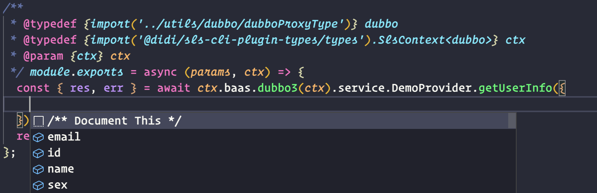

对于简单的类型入参，我们可以直接传入原生的JS字面量对象，自动生成的 `ProxyService` 会自行做转换；在使用过程中，我们也能获得类型提示，得到良好的开发体验。

## 高级用法

绝大多数情况下，都不需要考虑高级用法，直接调用方法传入字面量对象就可以实现 `Dubbo` 调用。下面是一些其他情况：

### 1. 重载（同名方法）

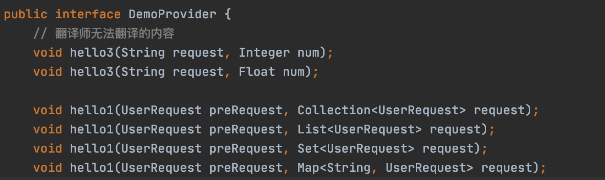

当出现这种同名不同参的时候，`ProxyService` 会生成一个同名函数调用，但是会生成多个不同的入参对象供使用，例如我们调用 `hello3` 方法，可以直接获得提示调用不同的入参

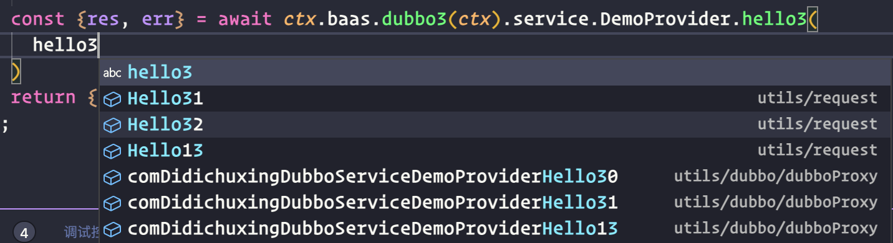

此时我们使用其中一个入参，在编写时就能了解当前使用的那个重载方法

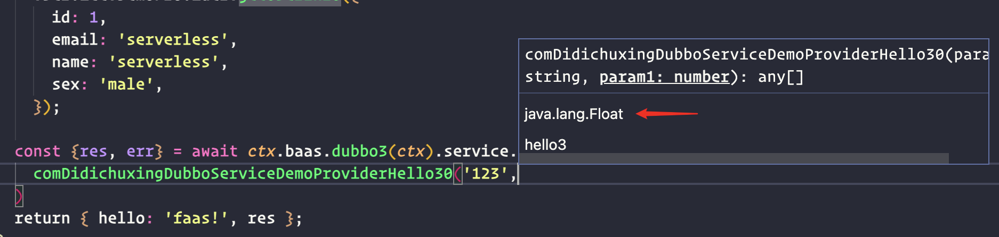

### 2. 多态（拓展入参）

这种情况会出现在入参是一个父类，具体到方法中就需要子类的属性；

应对这种情况，仅靠 `元数据` 提供的类型是不足以支撑我们的方法的调用，我们需要自行拓展传入的参数进行转换；我们可以声明一个自定义的 `class` ：


通过对 `super.__fields2java` 返回值的增强，达到所需要的效果；使用它仅需要将这个对象实例化并传入方法中即可

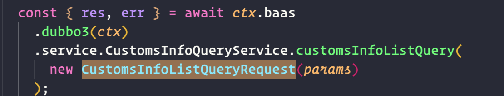

## 小结

通过本章，读者可以体验一下插件安装前后的开发体验对比

在使用过程中，还希望读者能加上序列化快照测试，以免接口变化导致服务异常

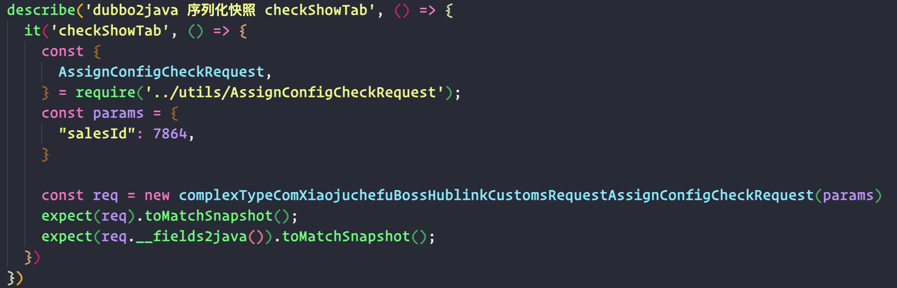

# 原理及实现

> 思路： 依赖 Dubbo 2.7+ 提出的 元数据中心进行 `ProxyService` 自动生成和提示

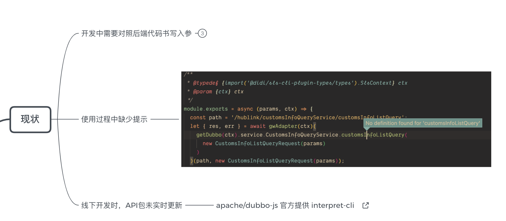

首先描述一下现状，除去在上文提及的 “需要用户自行查看 `java` 的代码来编写 `Proxy`” 外，还涉及到使用过程的体验。

在开源的 `dubbo-js` 提出的方案中，会将 `jar` 包下载并解析 `ast` 结构，最后转换成 `TS` 的方式来生成，思路如下：

1. 从源码、字节码中抽取 `ast` 结构
2. `java` 接口转换为 `typescript`
3. `javascript` 参数转换为 `hession` 所需类型

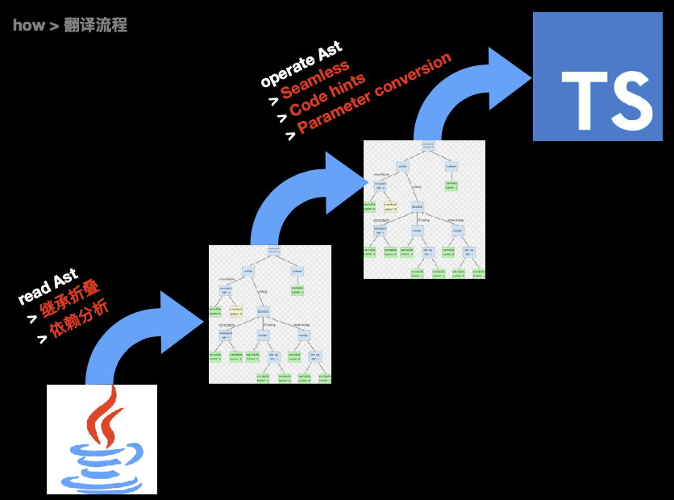

这里存在的问题是：我们无法确保开发同学会上传最新的 `jar` 包始终为最新（规范问题），导致接口与测试环境所运行的代码的不一致

得益于 `dubbo 2.7` 提供的元数据中心（`metadata`），我们可以避免以上的问题，快速实现我们所需的`ProxyService` 生成和提示能力

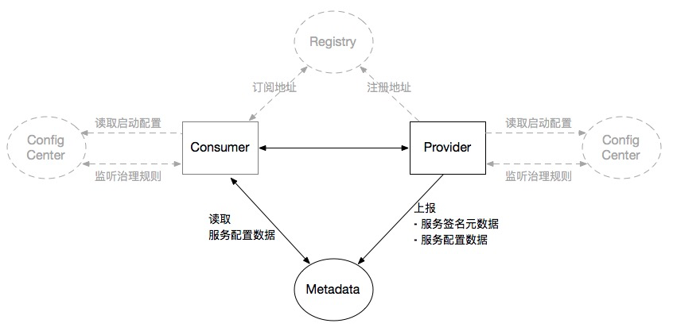

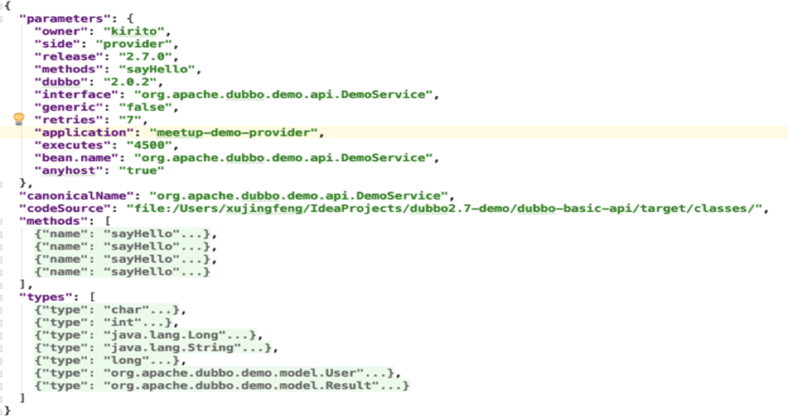

参照于这个元数据结构，加之映射关系，我们可以简单地生成所需要的 `ProxyService`

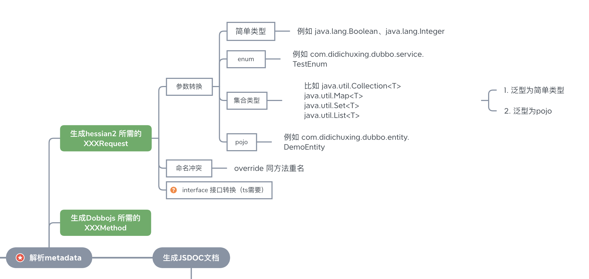

最终的实现不到千行代码（[git地址](http://git.xiaojukeji.com/hekunyu/sls-cli-plugin-sls-plugin-generator-dubbo-meta)，之后会迁移），没有那么多奇淫技巧，堆砌在一起就成了现在这种不是不能用的状态（所以还是beta版，已经用在业务上跑了）


单单只是做了转换并不能带来多少体验上的升级，还需要考虑到 `jsdoc` 的生成

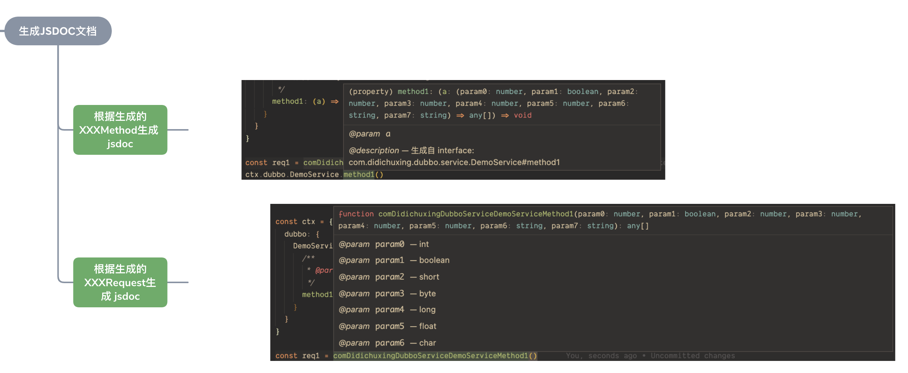

如果遇到了转换上的问题，请联系我并带上那个目录下的元数据（配置中的`baas.dubbo3.config.outputDir`) 路径里的 `json` 文件，进行一波 bug 的修复~

感谢在此期间赵磊鹏、周飞、韩晨雨、林文翔，还有各个大佬们的帮助，还有内网的比如志鹏等作者对ts的分享，带来了一部分灵感。

# 参考链接

1. 元数据参考手册 - [https://dubbo.apache.org/zh/docs/v2.7/user/references/metadata/](https://dubbo.apache.org/zh/docs/v2.7/user/references/metadata/)